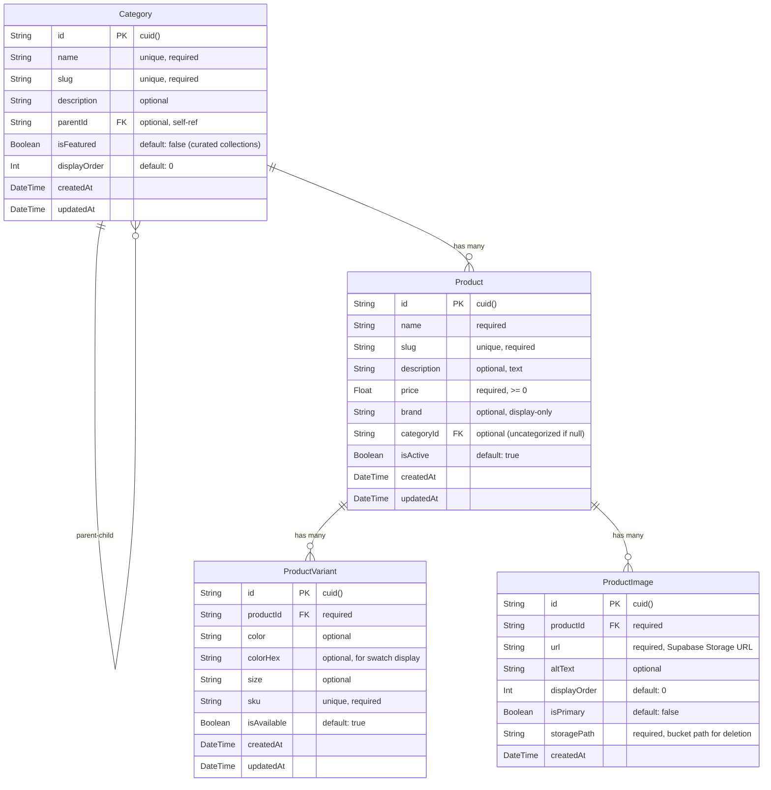

# Data Model: Cozy Corner E-Commerce Platform

**Branch**: `002-cozy-corner-ecommerce` | **Date**: 2026-03-28

## Entity Relationship Diagram

## Entity Definitions

### Category

Represents a product grouping. Supports hierarchical nesting via self-referencing `parentId`. Categories marked `isFeatured: true` appear in the mega-menu "curated collections" section.

| Field | Type | Constraints | Notes |
|-------|------|-------------|-------|
| id | String | PK, cuid() | Auto-generated |
| name | String | Required, unique | Display name |
| slug | String | Required, unique | URL-safe identifier, auto-derived from name |
| description | String? | Optional | Category description for category pages |
| parentId | String? | FK → Category.id, ON DELETE SET NULL | Enables hierarchy |
| isFeatured | Boolean | Default: false | When true, shows in mega-menu curated collections |
| displayOrder | Int | Default: 0 | Controls ordering in navigation and listings |
| createdAt | DateTime | Auto-set | |
| updatedAt | DateTime | Auto-updated | |

**Relationships**: 
- Self-referencing: `parent` (optional Category) / `children` (Category[])
- Has many: `products` (Product[])

**Validation Rules**:
- Name: 1–100 characters, unique
- Slug: auto-generated from name, must be URL-safe, unique
- Cannot be its own parent (no self-referencing cycle)

**Lifecycle**: When deleted, child categories have `parentId` set to null (become top-level). Associated products have `categoryId` set to null (become uncategorized).

---

### Product

Core entity representing a sellable item. Brand is a plain text field (display-only). A product without a `categoryId` is considered uncategorized.

| Field | Type | Constraints | Notes |
|-------|------|-------------|-------|
| id | String | PK, cuid() | Auto-generated |
| name | String | Required | Product display name |
| slug | String | Required, unique | URL-safe identifier |
| description | String? | Optional, Text type | Full product description (supports long text) |
| price | Float | Required, >= 0 | Base price in default currency |
| brand | String? | Optional | Display-only text attribute |
| categoryId | String? | FK → Category.id, ON DELETE SET NULL | Null = uncategorized |
| isActive | Boolean | Default: true | Soft visibility toggle |
| createdAt | DateTime | Auto-set | |
| updatedAt | DateTime | Auto-updated | |

**Relationships**:
- Belongs to: `category` (optional Category)
- Has many: `variants` (ProductVariant[]), `images` (ProductImage[])

**Validation Rules**:
- Name: 1–200 characters
- Price: non-negative number
- Slug: auto-generated from name, unique

**Computed Properties** (application-level):
- `primaryImage`: First image where `isPrimary = true`, or first by `displayOrder`
- `availableColors`: Distinct colors from variants where `isAvailable = true`
- `availableSizes`: Distinct sizes from variants where `isAvailable = true`

---

### ProductVariant

Represents a specific color/size combination for a product. Each variant has a unique SKU.

| Field | Type | Constraints | Notes |
|-------|------|-------------|-------|
| id | String | PK, cuid() | Auto-generated |
| productId | String | FK → Product.id, ON DELETE CASCADE | Required parent |
| color | String? | Optional | Color name (e.g., "Navy Blue") |
| colorHex | String? | Optional | Hex code for UI swatch (e.g., "#1B2A4A") |
| size | String? | Optional | Size label (e.g., "S", "M", "L", "42") |
| sku | String | Required, unique | Stock keeping unit |
| isAvailable | Boolean | Default: true | Availability toggle |
| createdAt | DateTime | Auto-set | |
| updatedAt | DateTime | Auto-updated | |

**Relationships**:
- Belongs to: `product` (Product)

**Validation Rules**:
- SKU: 1–50 characters, unique across all variants
- At least one of `color` or `size` should be set (application-level validation)
- If `color` is set, `colorHex` should ideally be set for swatch display

**Lifecycle**: Cascade-deleted when parent product is deleted.

---

### ProductImage

Represents an image file stored in Supabase Storage, associated with a product.

| Field | Type | Constraints | Notes |
|-------|------|-------------|-------|
| id | String | PK, cuid() | Auto-generated |
| productId | String | FK → Product.id, ON DELETE CASCADE | Required parent |
| url | String | Required | Public URL from Supabase Storage CDN |
| altText | String? | Optional | Accessibility alt text |
| displayOrder | Int | Default: 0 | Lower = displayed first |
| isPrimary | Boolean | Default: false | Only one per product should be true |
| storagePath | String | Required | Bucket path (e.g., "products/abc/image1.webp") for deletion |
| createdAt | DateTime | Auto-set | |

**Relationships**:
- Belongs to: `product` (Product)

**Validation Rules**:
- Only one image per product should have `isPrimary = true` (application-level enforcement — when setting a new primary, unset the previous one)
- File constraints: max 5 MB, JPEG/PNG/WebP formats only (validated at upload time)

**Lifecycle**: Cascade-deleted when parent product is deleted. When an image record is deleted, the corresponding file in Supabase Storage must also be removed.

## Indexes

| Table | Index | Type | Purpose |
|-------|-------|------|---------|
| Category | slug | Unique | URL lookups |
| Category | parentId | Standard | Hierarchy queries |
| Category | isFeatured | Standard | Mega-menu curated collections |
| Product | slug | Unique | URL lookups |
| Product | categoryId | Standard | Category page listings |
| Product | brand | Standard | Filter queries |
| Product | price | Standard | Sort/filter queries |
| Product | name, description | GIN (tsvector) | Full-text search |
| ProductVariant | productId | Standard | Product detail lookups |
| ProductVariant | sku | Unique | SKU lookups |
| ProductImage | productId | Standard | Image gallery queries |
| ProductImage | productId, isPrimary | Composite | Primary image lookups |
